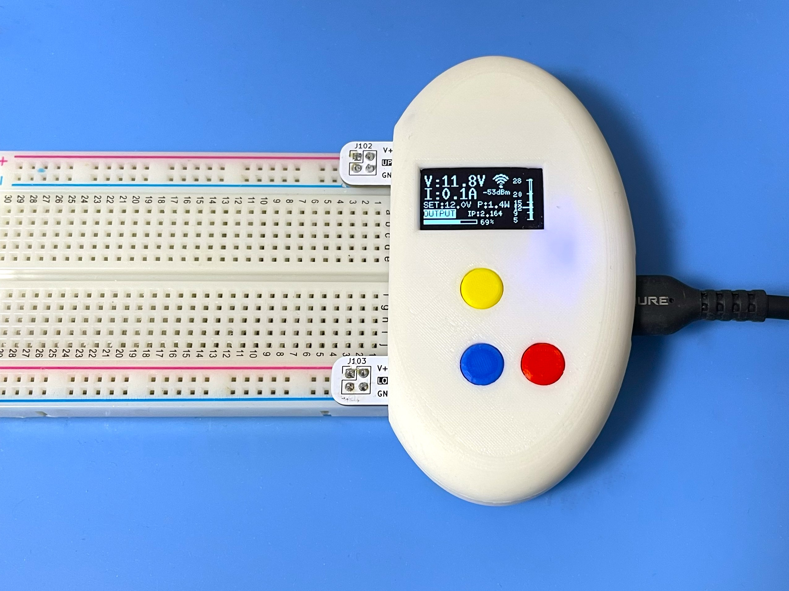
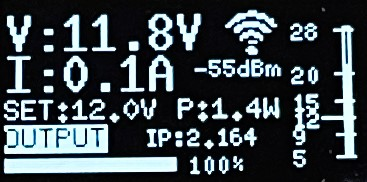
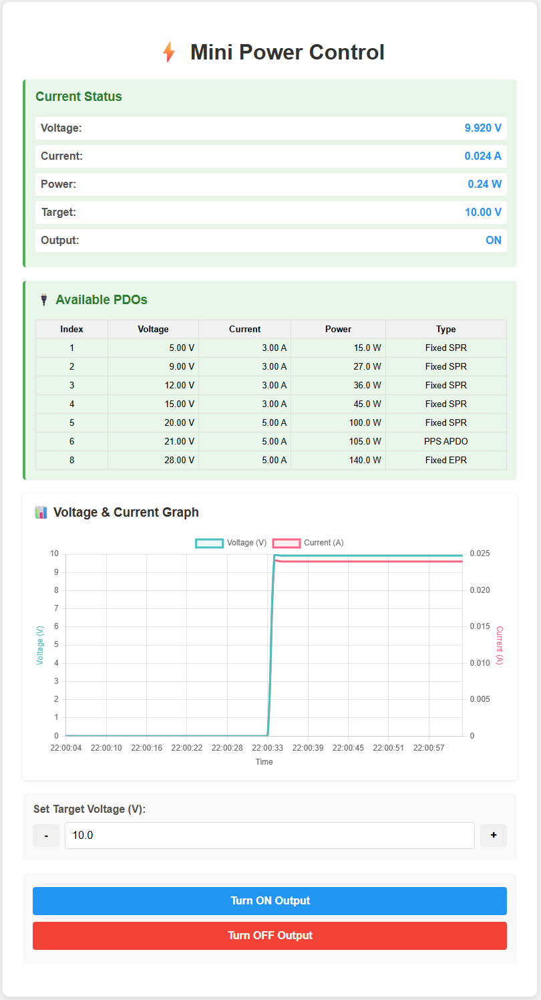
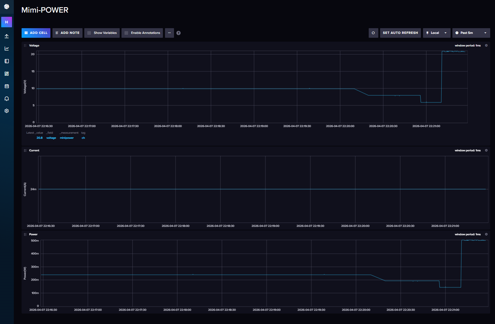

<div align="center">
  <h1><code>Mini Power for Breadboard</code></h1>
  <p>
    
  </p>
</div>

# Mini-Power

Mini-Power is a small, portable DC power supply unit designed to provide a convenient and reliable source of adjustable voltage for your electronic devices and breadboard experiments. Powered from a USB Power Delivery (PD) charger, it supports both Standard Power Range (SPR) and Extended Power Range (EPR) modes, making it perfect for electronics developers, students, and anyone who needs a compact bench power supply.

## Key Features

- **Easy access to the breadboard**: both sides accessible via standard 2.54mm pitch pin headers.
- **USB PD support**: 5V to 28V output using the AP33772S PD Sink Controller.
- **Variable voltage**: 0.1V steps using PPS APDO, with automatic fallback to the nearest Fixed PDO.
- **Real-time display**: SSD1306 128×64 OLED showing output voltage, measured voltage, current, power, WiFi status, and buffer usage.
- **Data logging**: Measurements sent to InfluxDB over WiFi (InfluxDB Line Protocol, HTTPS).
- **Remote syslog**: RFC 5424 over UDP for monitoring and troubleshooting.
- **HTTP web interface**: Real-time graphs (Chart.js), voltage control, and output ON/OFF toggle from any browser on the local network.
- **Three-button interface**: Up / Down / Center push buttons for direct voltage adjustment and output control.
- **NVS persistence**: Last voltage setting is saved to flash and restored on reboot.
- **Safety protections**: OVP, UVP, OCP (in AP33772S hardware) plus software current/power limits and voltage overshoot detection (>110% of setpoint).

## Hardware Components

| Reference | Part | Description |
|---|---|---|
| U103 | ESP32-C3-WROOM-02-N4 | Main microcontroller (RISC-V, built-in WiFi, 4MB flash) |
| U104 | AP33772SDKZ-13-FA01 | USB Power Delivery Sink Controller (SPR + EPR), QFN4040-24 |
| U102 | SSD1306 | Monochrome OLED display (128×64 pixels, I2C) |
| U101 | PCA9306D | Dual bidirectional I2C voltage-level translator (SSOP-8) |
| U105 | NJW1933F1 | Synchronous step-down DC/DC converter for 3.3V supply (SOT-23-6) |
| Q101, Q102 | DMN3008SFG | Dual N-channel MOSFET for output switching (PowerDI3333-8) |
| J101 | USB4105-GF-A | USB Type-C connector (input) |
| J102, J103 | 2×2 pin header | Output terminals (UPPER OUT / LOWER OUT), 2.54mm pitch |
| SW101–SW103 | TS-06104 | Push buttons: Up (GPIO10), Down (GPIO20), Center (GPIO21) |
| R110 | 5mΩ shunt resistor | Current sensing resistor (2512 package) |
| L101 | 22µH | Inductor for DC/DC converter |
| D101 | LED (Blue) | Status indicator |
| D102 | SK36A-LTP | Schottky diode (SMA) |
| FB101 | MH2029-601Y | Ferrite bead for EMI filtering |

Schematic and PCB files are in the `hardware/` directory. The board is designed with [KiCad](https://www.kicad.org/). A PDF export of the schematic is available at [`hardware/schematic.pdf`](hardware/schematic.pdf).

The [ap33772s-driver](https://github.com/hnz1102/ap33772s-driver) crate is used for all USB-PD communication with the AP33772S controller.

## Software Architecture

The firmware is written entirely in Rust using the ESP-IDF framework.

| File | Responsibility |
|---|---|
| `main.rs` | Startup, peripheral init, NVS load/save, main control loop |
| `usbpd.rs` | AP33772S PD driver wrapper (PDO negotiation, custom voltage request, VOUT control) |
| `displayctl.rs` | SSD1306 OLED driver, display thread, PDO list screen |
| `currentlogs.rs` | In-memory ring buffer (up to 127 records) for voltage/current/power/temp data |
| `transfer.rs` | InfluxDB Line Protocol HTTP transfer thread |
| `httpserver.rs` | HTTP server, REST API (`/api/status`, `/api/voltage`, `/api/output`, `/api/pdos`), embedded HTML/JS |
| `keyevent.rs` | GPIO key scanner (10ms polling, 100ms guard time) with long-press detection |
| `wifi.rs` | WiFi connection, RSSI monitoring, automatic reconnect |
| `syslogger.rs` | RFC 5424 UDP syslog, replaces the default ESP console logger |

## How to Use the Unit

### Basic Operation

1. **Connection**: Connect a USB-C PD charger*1 to the input port.
2. **Power On**: The unit negotiates PD profiles and scrolls through the available PDO list on the display.
3. **Main Screen**: After getting a IP address from DHCP server*2, the display shows output voltage, current, power, WiFi RSSI, IP address(last two octets)and buffer usage. 
4. **Voltage Selection**: Press **Up(yellow)** or **Down(blue)** to increase/decrease the target voltage in 0.1V steps.
5. **Output Control**: Press **Center(red)** to toggle output ON/OFF.
6. **Monitoring**: View real-time measurements on the OLED display or open `http://<device-ip>/` in a browser.

**Note** 
*1: When it doesn't connect to the PD charger, the display will show "No PD Power". Click the up/down buttons to show main screen. It only can output 5V.
*2: If it can't connect to WiFi, the display will show the main screen after 30 seconds, but without IP address and RSSI. 

### Button Controls

| Button | GPIO | Function |
|---|---|---|
| Up | GPIO10 | Increase output voltage by 0.1V |
| Down | GPIO20 | Decrease output voltage by 0.1V |
| Center | GPIO21 | Toggle output ON/OFF |

### OLED Display

The SSD1306 128×64 monochrome OLED display is divided into several regions as shown below.



| Area | Content | Detail |
|---|---|---|
| `V:xx.xV` | Measured voltage | Read from AP33772S (updated every 100ms when output ON) |
| `I:xx.xA` | Measured current | Read from AP33772S (updated every 100ms when output ON) |
| `SET:xx.xV` | Target output voltage | Blinks while PD voltage negotiation is in progress |
| `P:xx.xW` / `P:xx.xmW` | Measured power | Auto-range: switches between mW and W (threshold 0.5W / 1.0W) |
| `OUTPUT` / `STOPPED` | Output state | `OUTPUT` shown inverted (white on black) when output is ON |
| IP address | Last two octets of device IP | e.g. `IP:2.142` for `192.168.2.142` |
| Buffer bar | InfluxDB send buffer usage | 60px wide bar; fills left-to-right as records accumulate (max 127) |
| `xxx%` | Buffer usage percentage | Displayed to the right of the buffer bar |
| WiFi icon | WiFi signal strength | 5-level icon (wifi-0 to wifi-4) based on RSSI; animated while connecting |
| `+xx dBm` | RSSI value | Shown below WiFi icon when connected |
| Voltage bar (right edge) | PDO voltage range | Vertical bar showing min–max PD voltage; Variable/PPS range filled, Fixed PDO voltages marked as horizontal lines; current SET voltage shown as a longer line marker |

**Startup sequence:**

1. At boot, the PDO list screen is shown first — all Power Data Objects negotiated with the charger are listed (voltage, current, max power, type). Each page is shown for 3 seconds.
2. After PDO display completes, the main screen appears.
3. Error / warning messages (e.g. `Voltage Overshoot`, `Current OV x.xxxA`) replace the main screen temporarily and auto-dismiss after 3 seconds.

### HTTP Web Interface

When connected to WiFi, open `http://<device-ip>/` (IP shown on OLED display) to access:

- Live voltage, current, and power readings updated every second
- Real-time voltage and current graph (Chart.js)
- PDO table showing all available power profiles from the charger
- Voltage control with +/− buttons (0.1V step)
- Output ON/OFF toggle



### Safety Protections

| Protection | Mechanism |
|---|---|
| Over Voltage Protection (OVP) | AP33772S hardware |
| Under Voltage Protection (UVP) | AP33772S hardware |
| Over Current Protection (OCP) | AP33772S hardware |
| Software current limit | Output disabled if current exceeds `max_current_limit` |
| Software power limit | Output disabled if power exceeds `max_power_limit` |
| Voltage overshoot detection | Output disabled if measured voltage > 110% of setpoint |

## How to Build from Code and Install to the Unit

### Using Ubuntu 22.04 LTS

**1. Install Rust Compiler**

```bash
sudo apt update && sudo apt -y install git python3 python3-pip gcc build-essential \
  curl pkg-config libudev-dev libtinfo5 clang libclang-dev llvm-dev udev libssl-dev python3.10-venv nano
```
```bash
curl --proto '=https' --tlsv1.2 -sSf https://sh.rustup.rs | sh
# Select option 1 (default install)
```
```bash
source "$HOME/.cargo/env"
```

**2. Install toolchain for ESP32-C3**

```bash
cargo install ldproxy
cargo install cargo-binstall
cargo install espup
espup install
espup update
. ./export-esp.sh
cargo binstall cargo-espflash
```

**3. Add UDEV rules**

```bash
sudo sh -c 'echo "SUBSYSTEMS==\"usb\", ATTRS{idVendor}==\"303a\", ATTRS{idProduct}==\"1001\", MODE=\"0666\"" \
  > /etc/udev/rules.d/99-esp32.rules'
sudo udevadm control --reload-rules
sudo udevadm trigger
```

**4. Clone the repository**

```bash
git clone https://github.com/hnz1102/mini-power.git
cd mini-power/code
```

**5. Configure WiFi and InfluxDB**

```bash
cp cfg.toml.samp cfg.toml
nano cfg.toml
```

```toml
[mini-power]
wifi_ssid = "YOUR_WIFI_SSID"
wifi_psk = "YOUR_WIFI_PASSWORD"
influxdb_server = "192.168.x.x:8086"
influxdb_api_key = "<YOUR_API_KEY>"
influxdb_api = "/api/v2/write?org=<ORG>&bucket=LOGGER&precision=ns"
influxdb_measurement = "minipower"
influxdb_tag = "ch"
max_current_limit = "5.2"
max_power_limit = "100.0"
max_temperature = "75"
syslog_server = "192.168.x.x:514"
syslog_enable = "false"
```

**6. Connect the board and verify**

```bash
cargo espflash board-info
# Select /dev/ttyACM0
# Expected: Chip type: esp32c3, Flash size: 4MB
```

**7. Build and flash**

```bash
cargo espflash flash --release --monitor
```

The device boots automatically after flashing. The OLED display will show the PDO list negotiated with the charger, then switch to the main monitoring screen.

## How to Install InfluxDB and Configure the Dashboard

**1. Download and install InfluxDB**

```bash
wget https://dl.influxdata.com/influxdb/releases/influxdb2-2.7.0-amd64.deb
sudo dpkg -i influxdb2-2.7.0-amd64.deb
sudo service influxdb start
```

**2. Initial configuration**

Open `http://<server-ip>:8086`. Click `GET STARTED` and set:

| Term | Value |
|---|---|
| Username | Admin login username |
| Password | Admin login password |
| Initial Organization Name | e.g. `ORG` |
| Initial Bucket Name | `LOGGER` |

**3. Get the API Token**

Copy the Operator API Token shown after setup — you will not see it again. To generate a new token later: `API Tokens` → `GENERATE API TOKEN` → `All access token`.

**4. Import the Dashboard Template**

Click `Dashboard` → `CREATE DASHBOARD` → `Import Dashboard`. Drop the `influxdb/mimi-power.json` file into the import dialog, then click `IMPORT JSON AS DASHBOARD`.

You will see the **Mimi-POWER** dashboard. It contains three time-series graphs:

| Chart | Field | Unit |
|---|---|---|
| Voltage | `voltage` | V |
| Current | `current` | A |
| Power | `power` | W |

All charts query the `LOGGER` bucket, measurement `minipower`, tag `tag = "ch"`.



**5. Start logging**

Enable the output on the Mini-Power unit (Center button or web interface). Measurement data will be sent to InfluxDB and appear on the dashboard in real-time.

## Schematic and PCB Data

The PCB is designed with [KiCad](https://www.kicad.org/). All hardware design files are in the `hardware/` directory.

| File / Directory | Description |
|---|---|
| [`hardware/schematic.pdf`](hardware/schematic.pdf) | Schematic PDF (for viewing without KiCad) |
| `hardware/mini-power.kicad_sch` | KiCad schematic source |
| `hardware/mini-power.kicad_pcb` | KiCad PCB layout |
| `hardware/bom.csv` | Bill of Materials |
| `hardware/production/` | Gerber files for PCB manufacturing (`mini-power.kicad_pcb_gerber.zip`) |

## 3D Printed Enclosure

The enclosure design files are in the `hardware/Container/` directory.

| File | Description |
|---|---|
| `body.3mf` | Main enclosure body |
| `upper.3mf` | Top cover |
| `button.3mf` | Button cap for the three push switches |
| `mini-power.f3d` | Fusion 360 source file |

All parts are designed for FDM 3D printing. Print `body.3mf`, `upper.3mf`, and three copies of `button.3mf`.

## License

This source code is licensed under MIT. Other Hardware Schematic documents are licensed under CC-BY-SA V4.0.
